# SameSite Cookie Protection Explained

## 🎯 **How SameSite=Lax Protects Your Application**

### **Attack Scenario: Without SameSite Protection**

```mermaid
sequenceDiagram
    participant User
    participant EvilSite as evil.com
    participant Browser
    participant YourApp as your-admin.com

    User->>YourApp: 1. Login (gets auth cookie)
    Note over Browser: Cookie: auth=token123
    
    User->>EvilSite: 2. Visits malicious site
    EvilSite->>Browser: 3. Hidden form to your-admin.com
    Browser->>YourApp: 4. POST /api/delete-user (with cookie!)
    YourApp->>Browser: 5. ✅ Success (user deleted!)
    Note over User: 😱 User data deleted without consent!
```



### **Protection: With SameSite=Lax**

```mermaid
sequenceDiagram
    participant User
    participant EvilSite as evil.com
    participant Browser
    participant YourApp as your-admin.com

    User->>YourApp: 1. Login (gets SameSite=Lax cookie)
    Note over Browser: Cookie: auth=token123; SameSite=Lax
    
    User->>EvilSite: 2. Visits malicious site
    EvilSite->>Browser: 3. Hidden form to your-admin.com
    Browser->>YourApp: 4. POST /api/delete-user (NO COOKIE!)
    YourApp->>Browser: 5. ❌ 401 Unauthorized
    Note over User: ✅ Attack blocked! Data safe!
```

## 📊 **Your Current Cookie Configuration**

### **In Development (`VITE_USE_MOCK=false`):**
```http
Set-Cookie: gjpb_access_token=eyJ...; path=/; SameSite=Lax
Set-Cookie: gjpb_refresh_token=eyJ...; path=/; SameSite=Lax
```

### **In Production:**
```http
Set-Cookie: gjpb_access_token=eyJ...; path=/; Secure; SameSite=Lax
Set-Cookie: gjpb_refresh_token=eyJ...; path=/; Secure; SameSite=Lax
```

## 🔒 **Security Comparison**

| Protection Method | Setup Complexity | Browser Support | Security Level |
|-------------------|------------------|-----------------|----------------|
| **SameSite=Lax** | ✅ Built-in | ✅ 95%+ browsers | 🔒🔒🔒 High |
| CSRF Tokens | ❌ Complex | ✅ All browsers | 🔒🔒🔒 High |
| SameSite=Strict | ✅ Built-in | ✅ 95%+ browsers | 🔒🔒🔒🔒 Maximum |
| No Protection | ✅ None | ✅ All browsers | ❌ Vulnerable |

## 🌐 **Browser Compatibility**

### **Supported Browsers:**
- ✅ Chrome 51+ (2016)
- ✅ Firefox 60+ (2018)
- ✅ Safari 12+ (2018)
- ✅ Edge 16+ (2017)

### **Fallback for Old Browsers:**
- Older browsers ignore SameSite attribute
- Still protected by CORS and same-origin policies
- Your JWT in Authorization headers provides additional security

## 🚀 **Real-World Attack Prevention**

### **What SameSite=Lax Blocks:**
```javascript
// ❌ BLOCKED: Evil site trying to POST to your API
fetch('https://your-admin.com/api/users', {
  method: 'POST',
  credentials: 'include', // Tries to send cookies
  body: JSON.stringify({ action: 'delete' })
});
// Result: Cookies NOT sent, request fails
```

### **What SameSite=Lax Allows:**
```javascript
// ✅ ALLOWED: User clicking legitimate link
<a href="https://your-admin.com/dashboard">Go to Dashboard</a>
// Result: Cookies sent, user stays logged in
```

## 🔧 **Advanced Configuration Options**

If you wanted to make your cookies even more secure, you could:

### **Option 1: SameSite=Strict (Maximum Security)**
```typescript
// apps/shared-lib/src/utils/cookie.ts
export const setCookie = (
  name: string,
  value: string,
  maxAge?: number,
  path = '/',
  secure = import.meta.env.PROD,
  sameSite = 'Strict' // More secure, but may break user experience
): void => {
  // ...existing code...
};
```

### **Option 2: HttpOnly Cookies (XSS Protection)**
```typescript
// Note: HttpOnly can only be set server-side
// Your backend would need to set this:
// Set-Cookie: token=abc; HttpOnly; SameSite=Lax; Secure
```

## ✅ **Why Your Current Setup is Perfect**

### **SameSite=Lax is Ideal Because:**
1. **Blocks CSRF attacks** effectively
2. **Maintains user experience** (links work normally)
3. **Widely supported** by modern browsers
4. **Zero complexity** compared to CSRF tokens
5. **Industry standard** for SPAs

### **Combined with Your Other Protections:**
- 🔒 **SameSite=Lax** prevents cookie-based CSRF
- 🔒 **JWT in Authorization headers** prevents header-based attacks
- 🔒 **CORS policies** restrict cross-origin requests
- 🔒 **Secure attribute** protects against network sniffing (in production)

## 🎯 **Conclusion**

Your application uses **modern, industry-standard security** with SameSite cookies. This approach is:
- **Simpler** than traditional CSRF tokens
- **More reliable** than complex server-side validation
- **Better user experience** than strict security measures
- **Future-proof** with excellent browser support

**Result**: Maximum security with minimal complexity! 🚀
